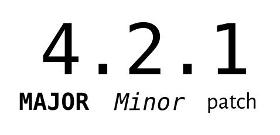

# Ex3 Software Release Practices
Written by Ben Tam
Last updated Nov 7, 2023

For all releases, versioning will be heavily important when it comes to organizing and managing releases, and this will come down to the level of abstraction for each new release. Unlike the usual sprint-based timeline that the rest of AlbertaSat follows, software team releases will be based on the [semantic versioning system](https://semver.org/ "Semantic Versioning Homepage") and [insert time based schedule here].

##Semantics of Release Versions

[1]

- **Major releases** are used to indicate the that new changes are incompatible or breaking with the previous API version.
  - E.g from ver 2.0.0 to 3.0.0
  - What is an incompatible API change?
    - A change in the software's library API that is not backwards-compatible with the previous version.
    - E.g removing or renaming existing classes or public functions, changing parameters and return values, changing existing functions in a way that is incompatible with previous versions, etc.
- *Minor releases* cover new backwards-compatible features added to the API, meaning that existing code using the previous version of the library should still work as intentioned. 
  - E.g from ver 2.1.0 to 2.2.0
- Patches are backwards-compatible bugfixes or minor improvements that do not make any meaningful changes to the API which would affect currently existing code.

##Versioning Specifications
The full list of specification rules can and should be read carefully from [here.](https://semver.org/#semantic-versioning-specification-semver) Note that early development versions will work from versions 0.xx.yy until the first major release of 1.xx.yy.

##Writing and Organizing Release and Patch Notes
Insert something here

##Organizing Software Versions
Insert something here

##Release Schedules 
Insert something here

