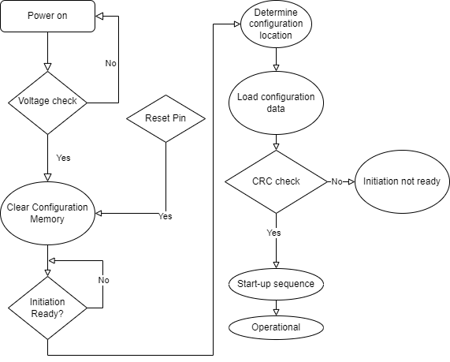

# FPGA Boot Sequence

- Xilinx websites seem to suggest that when programming the FPGA, we are
actually programming the configuration memory, which is then used when the FPGA boots.

## Boot sequence flow chart

### Stages

1. **Power on** - Device boots up and the start-up sequence flow begins.
2. **Voltage check** - FPGA checks to make sure that all the necessary voltage for operations are correct.
3. **Clear configuration memory** - There is a pin that when set to active, will cause the FPGA to clear its memory. (Unclear if this is the flash that is being cleared.)
4. **Initiation ready** - The FPGA will block its boot sequence until the initiation ready pin is set to active. This is so that other components on the board will have the time to boot up.
5. **Determining the configuration location** - With the state of another pin, the FPGA does checks on where its configuration is stored.
6. **Load the configuration** - The FPGA loads the configuration data from the flash that it was stored at.
7. **CRC check** - Some error detection in case the loaded data is wrong. Turns the initiation ready pin down, likely causing the boot-up process to restart, or throw an error.
8. **Start-up sequence** - Begins the start-up sequence.
9. **Operational** - Boot up sequence completed.

## Is FPGA configuration persistent?

According to StackOverflow, Xilinx FPGAs are not persistent since the logic fabric are composed of volatile memory. To be able to store the programming done, the FPGA needs to load its configuration from non-volatile flash memory.
