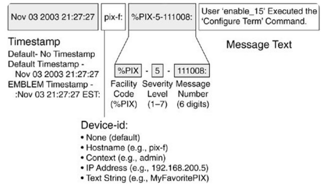

# Linux Logging

## Overview

The FSW needs to be able to log both kernel and application level
information efficiently.

## Research

### Typical Linux use case

- Kernel logging vs User logging
  - User space vs kernel space.
  - Kernel has a ring buffer that holds log messages. It's a circular buffer. Starts before user logging. Accessible via `dmesg`.
    - The terminal, and therefore the user space is able to access the circle buffer by reading a file called `/dev/kmsg`. This file has access to the ring buffer structure that holds the log.
    - The ring buffer will then dump the content into `/proc/kmsg`.
    - `/dev/kmsg` acts like an entry point to the ring buffer, since you are able to both read and write to it.
    - `/proc/kmsg` is only for reading since it is not an entry point to the ring buffer.
  - User space logging is based on the `syslog` protocol.
    - This protocol defines how messages are formatted for an application to send logs.
    - Two new terms: *facilities* and *priorities*.
      - **Facility levels** - Used to determine which part of the system sent the log. There are at least 23 facilities, and they include things from kernel and mail to clock and scheduling. A few of the levels are preserved for custom programs.
      - **Priorities** - Shows the severity of the log message. There are 8 levels, with the lowest value being the biggest emergency.
    - Architecture:
      - **Originator** - The syslog client. Sent the syslog formatted message over the network, or to the correct application.
      - **Relay** - used to forward messages over a network. Could add more to the message.
      - **Collector** - The syslog server. Collects and stores (and maybe view) the log.
    - Syslog is a client server architecture.
  - Linux local logging
    - You can log using the same architecture as syslog.
    - client applications are originators
    - no need for a relay, (unless we are transmitting back to ground station?)
    - Collectors are daemons that are listening on a certain socket.
    - Supposedly, in the Linux system, logs are stored in the `/var/log` directory.
    - The are two systems in the Linux operating system that collects logs. `rsyslog` and `systemd-journal`.
      - `rsyslog` makes permanent log in the `/var/log` directory
        - Listens to the syslog socket for new logs.
        - There are rules that controls which logs should be stored.
      - `systemd-journal` keeps a temp log unless configured otherwise.
        - A little weirder since the files are stored as binaries instead of a usually text file. Need to use `journalctl` to access the content.
        - Stored files in the `/run/log/journal` directory.
      - There is a way to store journal logs into rsyslog by changing the configuration of the rsyslog to take from journal.
      - `logger` is a built in utility that will send strings to a syslog server.

### Embedded readings

`printf` is expensive, so logging should maybe be deferred.

- An operating system called [Zephyr](https://docs.zephyrproject.org/latest/services/logging/index.html) uses deferred logging.
- Move the logging operation elsewhere. The logging client does not need to concern itself with string manipulation since it might be responsible for time critical operations.

The thing is, we are working with Linux, so we should be able to leverage the socket design paradigm to let the operating system do the scheduling work for us.

## Syslog

### Overview

- `syslog` is a logging protocol, featuring log priority levels, message frame
specifications, and logging resolution.
- It runs on a single server daemon system, where a `syslog` daemon will
be responsible for collecting all the `syslog` protocol logs that comes its
way.
- Most `syslog` daemons work with TCP, UDP, and UNIX sockets.

### Note

- Most Linux distros will have `rsyslog` come pre-installed.
- `rsyslog` requires `systemd` to run.

### Transaction protocol

- Syslog uses UDP, usually at port 514, to pass message to the daemon.
- It also has a TCP and Unix socket port that will accept `syslog` logs.

### Syslog packet

- Syslog uses UTF-8 encoding for its character.



- Syslog packets are composed of *header*, *structured-data (SD)*, and a message.
- **Header**:
  - Priority
  - Version
  - Timestamp
  - Hostname
  - Application
  - Process ID
  - Message ID
- **SD**:
  - "key=value" format
  - Unclear on usage for now
- **Message**:
  - Encoded using UTF-8
  - Can be arbitarily long

#### Example

```
<34>1 2003-10-11T22:14:15.003Z mymachine.example.com su - ID47 - BOM'su root' failed for lonvick on /dev/pts/8
```

Follows the following format:

```
<priority>VERSION ISOTIMESTAMP HOSTNAME APPLICATION PID MESSAGEID STRUCTURED-DATA MSG
```

### Log rotation

- The syslog daemon will rotate log files out of use every week. Once the
log file is two weeks old, the log file will get archived into a `.gz`.

### How to send a log to `syslog`

#### Simplest Solution

The most basic method of sending a log to the syslog daemon is by using the `logger` cli program. This program will read from stdin and send the information to the syslog daemon.

You can find the man page for the `logger` program [here](https://www.man7.org/linux/man-pages/man1/logger.1.html).

#### Rust Library

Rust has a library for interfacing with a syslog server. This crate page
is available [here](https://docs.rs/syslog/latest/syslog/).

- An implementation of the Rust syslog client has been created, and can be
accessed by clicking on [this](https://github.com/AlbertaSat/ex3_syslog_prototype) link.

## Figures and tables

| **Value** | **Severity** | **Keyword** | **Description** |
| --- | --- | --- | --- |
| 0 | Emergency | `emerg` | The panic condition in which multiple applications are failing. The system has become unusable. |
| 1 | Alert | `alert` | Condition that requires immediate fix. e.g., The final redundancy in the system has failed. |
| 2 | Critical | `crit` | A component of the `alert`. Just as severe, but a smaller portion of the issue. |
| 3 | Error | `err` | Non-urgent failure. Still must be resolved somehow. (We might use this label for self-correctable errors?)
| 4 | Warning | `warning` | Not errors, but warns of things that could eventually manifest in an error. |
| 5 | Notice | `notice` | Unusual conditions
| 6 | Informational | `info` | Messages for normal operations. Might be used for measurements. |
| 7 | Debug | `debug` | Not useful during operations. |

The table above is the list of priorities in the syslog standard.

## Resources

- [Top result on how logging works on Linux](https://devconnected.com/linux-logging-complete-guide/)
- [Embedded ninja post on embedded logging](https://blog.mbedded.ninja/programming/logging-on-an-embedded-system/)
- [2008 Stack Overflow answer that says that syslog was good for embedded linux](https://stackoverflow.com/a/340634)
- [Linux Handbook guide on using syslog](https://linuxhandbook.com/syslog-guide/)
- [Stackify guide on how syslog works](https://stackify.com/syslog-101/)
- [Syslog Protocol](https://datatracker.ietf.org/doc/rfc5424/)
- [Rust Syslog Library](https://docs.rs/syslog/latest/syslog/)
- [Other Rust logging methods](https://www.shuttle.rs/blog/2023/09/20/logging-in-rust)
