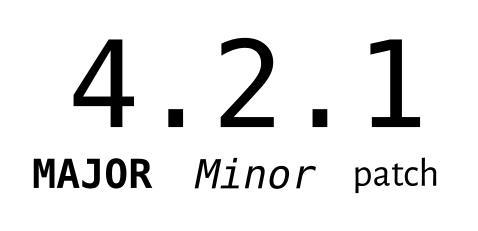

# Ex3 Software Release Practices
Written by Ben Tam
Last updated Jan 19, 2023


For all releases, versioning will be heavily important when it comes to organizing and managing releases, and this will come down to the level of abstraction for each new release. Unlike the usual sprint-based timeline that the rest of AlbertaSat follows, software team releases will be based on the [semantic versioning system](https://semver.org/ "Semantic Versioning Homepage") (SemVer), and [insert schedule system here]. 


## Semantics of Release Versions


[1]

- **Major releases** are used to indicate the that new changes are incompatible or breaking with the previous API version.
  - E.g from ver 2.0.0 to ver 3.0.0
  - What is an incompatible API change?
    - A change in the software's library API that is not backwards-compatible with the previous version.
    - E.g removing or renaming existing classes or public functions, changing parameters and return values, changing existing functions in a way that is incompatible with previous versions, etc.
- *Minor releases* cover new backwards-compatible features added to the API, meaning that existing code using the previous version of the library should still work as intentioned. 
  - E.g from ver 2.1.0 to ver 2.2.0
- _Patches_ are backwards-compatible bugfixes or minor improvements that do not make any meaningful changes to the API which would affect currently existing code.
  - E.g from ver 2.1.0 to ver 2.1.1


## Release Version Precedence
Each version number can be compared to each other, and there is a certain system of precedence in these comparisons. Generally the rule is that each level trumps the lower level regardless of number.
- E.g 1.8.3 < 2.0.0  due to a higher major release version (2 > 1).

The full order of precedence is:
1. Major (6.x.y)
2. Minor (x.5.y)
3. Patch (x.y.7)
4. Pre-release versions

When two release versions have the same major and/or minor version(s), it will come down to the whichever version has the higher minor/patch version.
- E.g 2.1.1 < 2.2.0 due to a higher minor release version but 2.2.0 < 2.2.1 due to a higher patch version.


## Initial Development Major Versions 0.xx.yy
Note that early development versions will work from versions 0.xx.yy until the first major release of ver 1.xx.yy. In this state **ANYTHING** can change and this version must be considered unstable.

The simplest way to handle early version semantics is to start at 0.1.0 at the very beginning then increment the minor versions from there.


## Full Versioning Specifications
The full list of specification rules can and should be read carefully from [here.](https://semver.org/#semantic-versioning-specification-semver)


## Writing and Organizing Release and Patch Notes
Full documentation of each version's change and release notes should be fully documented in ``Software_Changelog.md``. A short set of tips and guidelines on how to write effective and detailed release/patch notes can be found in ```release_practices/Writing_Release_Notes.md```.


## Organizing Software Versions
```Software_Changelog.md``` will contain and detail each and every version of the software team's work for ExAlta 3.


## Glossary For Dummies (aka me)
 - API: Application programming interface
    - Software that sends information back/forth between two or more computer programs.


