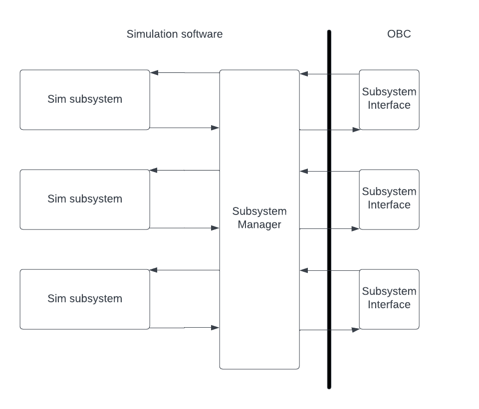

# Simulated subsytem architecture

-------------------------------------------

## Subsystem high level architecture diagram

## Brief explanation of architecture

### Sim subsystems

- Do subsystem specific things only such as managing internal subsystem state, and implementing specific functionality unique to the subsystem.
  Subsystems ignore implementation specifics for the communication interface.
- May Handle commands from OBC of the following type:
  - Execute - Tell subsystem to do something 
  - Update - Update a parameter in the subsystem
  - Request - Request data from the subsystem
- May Emit messages to OBC
  - Payload data (i.e. IRIS images, DFGM data structs etc..)
  - Responses to commands
  - Notifications
- Data may be piped into subsystem components backend from other software or apis.

### Subsystem Manager

- Centralized data flow handling. Routes and logs all data between OBC and subsystems.
- Central control allows subsystems processes to be started / killed for testing.
- May serve as a medium to simulate subsystem interface protocols / com buses. This keeps communication specifics isolated from subsystem component application specific code.
- Simplifies potential future implementation of a subsystem / simulated satellite ecosystem GUI.

### Subsystem Interfaces

- OBC FSW modules which act as interfaces / drivers to communicate with an associated subsystem. Also isolates communication handling from application specific module code.
