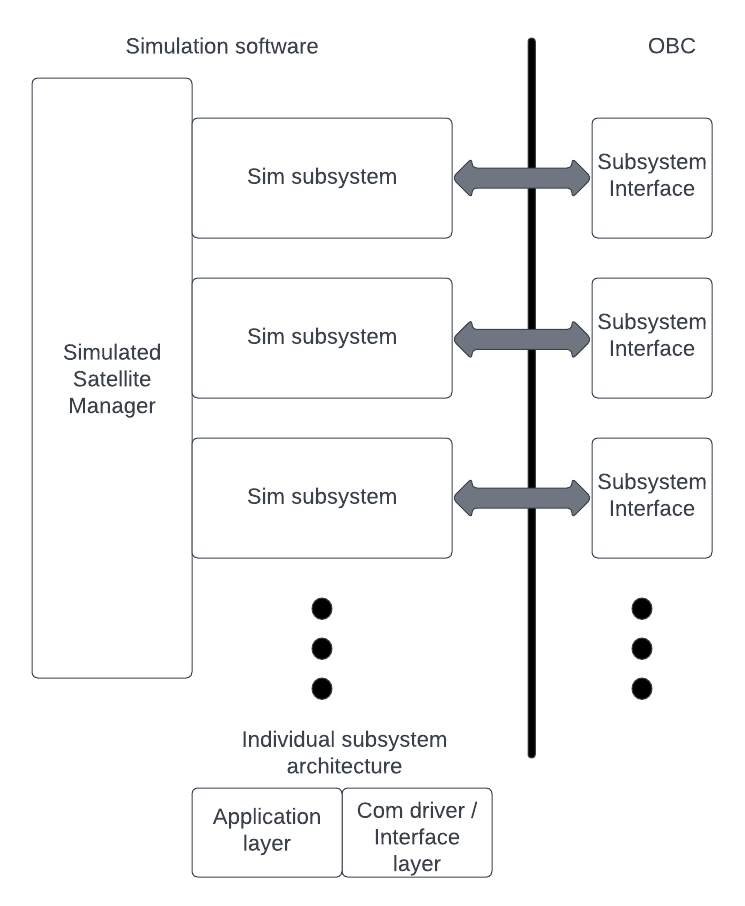

# Simulated subsytem architecture

-------------------------------------------

## Subsystem high level architecture diagram

## Brief explanation of architecture

### Sim subsystems

- Do subsystem specific things only such as managing internal subsystem state, and implementing specific functionality unique to the subsystem.
  Subsystems ignore implementation specifics for the communication interface such as 'I2C vs SPI vs CAN etc'.
- Each subsystem should be able to receive and emit messages. Because all subsystem will communicate in various ways, each subsystem simulated should have a dictionary of messages it expects to receive, along with a breif description of their format and function.
- All messages sent and received are logged by the individual subsystem upon receipt and send.
- Data may be piped between subsystem components backend and other software or apis.

#### Subsystem / payload message structure

- Each subsystem / payload has a unique message format/structure and thus is responsible for deconstructing incomming messages from the OBC, and constructing outgoing message to the OBC. This is because in reality most subsystems are third party devices which act like a black box and thus use their own unique message structure for control and emission of messages / notifications.
- The structure of the message for each subsystem should be somewhat similar with what is expected for the actual subsystem.

### Sim Satelllite Manager

- Responsible for Beginning the entire simualated sat ecosystem. The satellite ecosystem manager brings all the simulated subsystem modules together.
- Spawns each subsystem / payload as its own unique thread.
- Central control allows subsystems processes to be started / killed together or inidividually for testing.
- Simplifies potential future implementation of a subsystem / simulated satellite ecosystem GUI.
- May be used to establish connections to backend of each subsystem such as programs to generate realistic simulations data for things like the ADCS etc.
- Can be used to test boot up and other satellite wide operations. 

### Subsystem Interfaces

- OBC FSW modules which act as interfaces / drivers to communicate with an associated subsystem. Also isolates communication handling from application specific module code. Before ICDs are provided by the associated subsystems / payloads TCP sockets will be used. The interface / driver modules in the FSW for each subsystem / payload will be responsible for managing a unique socket for each.
